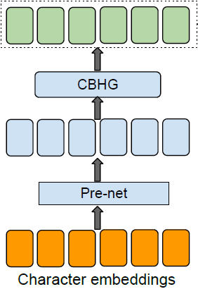
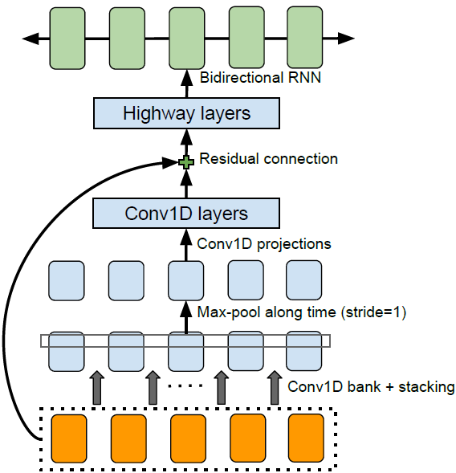
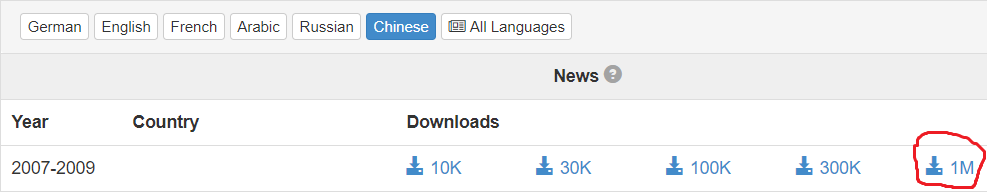
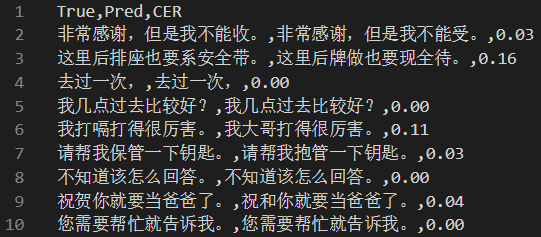

# Bopomofo2Chs

该项目使用神经网络实现拼音转汉字，如输入为连续的汉语拼音```mingtianzaoshangqingjiaoxingwo。```，那么模型的任务就是需要输出连续的汉字```明天早上请叫醒我。```。

模型来源于Tacotron架构，如下图所示：



其中CBHG的具体架构如下图所示：



数据集来源：[Leipzig Corpora Collection](http://wortschatz.uni-leipzig.de/en/download/)中的1M汉语新闻数据集：



并且只使用了```zho_news_2007-2009_1M-sentences.txt```。

## 项目组织

```
Bopomofo2Chs/
├── data
│   └── zho_news_2007-2009_1M-sentences.txt
├── dataset.py
├── eval
│   ├── eval_clean.txt
│   └── input.csv
├── model.py
├── network.ipynb
├── pre.py
├── README.md
├── train&eval.py
```

```dataset.py```: 提供数据支持；

```model.py```: 网络结构在这里定义；

```pre.py```: 对原始数据的预处理；

## requirements

```
xpinyin==0.5.6
tensorflow==1.9.0
Distance==0.1.3
numpy==1.15.2
regex==2019.06.08
```

## 使用说明

下载数据把所需的txt文件放到对应位置，运行```pre.py```，然后运行```train&eval.py```即可，程序会在```.eval/```下生成评估结果文件```eval_res.csv```。

## 评估

该任务选用编辑距离作为评估标准，归一化后的编辑距离是字符错误率(CER)，部分的评估结果如下图所示：



跑了$1$个epoch后的总CER为：$0.05$。

---

References: [Tacotron](https://arxiv.org/abs/1703.10135)

Acknowledgement: [Kyubyong](https://github.com/Kyubyong)
